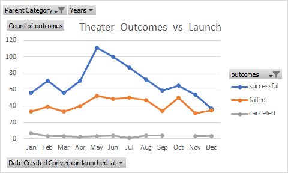
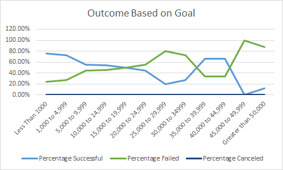

# Kickstarting with Excel

## Overview of Project
Louise’s play Fever came close to its fundraising goal in a short amount of time. Now, she wants to know how different campaigns fared in relation to their launch dates and their funding goals. 
Using the Kickstarter dataset this project visualize campaign outcomes based on their launch dates and their funding goals.

### Purpose
Louise wants to know how different campaigns fared in relation to their launch dates and their funding goals.

## Analysis and Challenges

### Analysis of Outcomes Based on Launch Date
The chart below gives a good picture of which months are the best and the worst to launch campaings.
It clearly shows May has the most successul campaigns and December has the most number of failures. 
Summer months are the better months to lunch cmpaign compare to winter months. 

### Analysis of Outcomes Based on Goals
The chart below explains which goal range has better chances to succeed and which goal range has the worst chances to succeed.
The goal with ranges less than 5000 has the most successful campaigns. The goal range and success rate has an inverse relationship. As the goal range increases, the success rate goes down. 

### Challenges and Difficulties Encountered
(1) The one of the chllaenge was the getting the range right in the analysis. There are several campaings, which have a goal of 5000, 10000.  If <= sign is not use in defining the range, it can give the wrong results. 
(2) Segmenting each goal range for "plays" by sucessul, failed and canceled "plays" was bit difficult.  Using multiple conditions in Count IFs helped to preapre the summrized dataset. 

## Results

### What are two conclusions you can draw about the Outcomes based on Launch Date?
  1. May is the best month to launch the campaigns. 
  (2) December is the worst month to launch the campaigns. 
  
### What can you conclude about the Outcomes based on Goals?
  (1) Range < 1000 : Campaing with goal to raise less than 1000 have higher chances to succeed.  
 
  
### What are some limitations of this dataset?
  (1) Most of the campaings have goal of < 10000. Sample size for higher goal range (more than 15,000) is very limited compare to <10,000.
  (2) Goal range of 45,000 to 49,000 has 0% sucess rate. But the dataset is limited to just 1 sample for that range.  Which makes it difficult to draw conclusions for this range.
  
### What are some other possible tables and/or graphs that we could create?
  (1) Using the same amount range, a pie chart can be created to show number of cmpaigns for each of the goal range.  This will clearly show the sample slection is skwed in favor of smaller goals.
  
  
  
